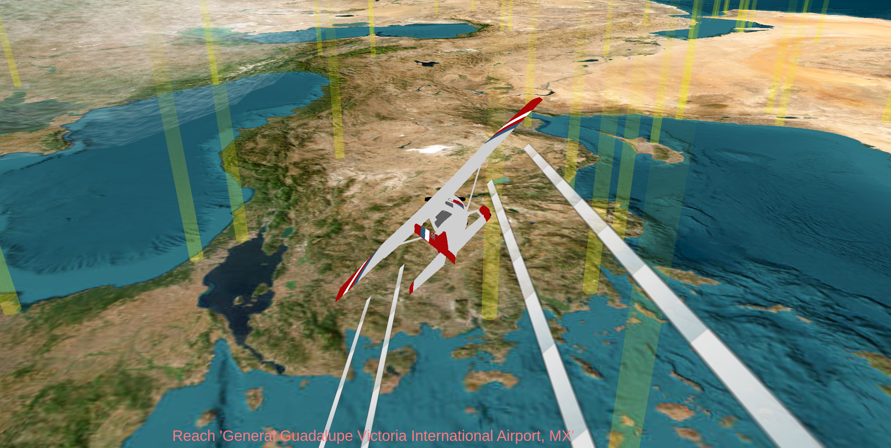

# PlaneSim
PlaneSim is a geography game where you try to find international airports while navigating around storms and avoiding other aircrafts.



| Keys | Function | 
|---|---|
| W, S | Accelerate / Decelerate |
| A, D | Yaw Rotation |
| Arrow_Up, Arrow_Down | Pitch Rotation |
| Arrow_Left, Arrow_Right | Roll Rotation |
| Space | Shoot rocket |
| Page_Up, Page_Down | Tilt Camera |
| 1, 2, 3 | Render Mode: Points / Wireframe / Textured|
| +, - | Zoom In / Out |
| Esc | Close App |

# Setup
Clone repository and install dependencies (Note: a virtual environment is recommended)
```
    git clone git@github.com:fabianstahl/PlaneSim.git
    cd PlaneSim
    pip install -r requirements
```

Download xyz tiles and follow instructions. These tiles are needed as game textures and are free. Depending on the zoom level this might take a while. A minimum zoom level of 6 is recommended.
```
python download_tiles.py
```

You can now start the game
```
python app.py
```

# TODOs
* Add Tiling around world borders / seemless transitions
* Add Airplane Shadow
* Add enemy interaction
* Add dangerous cloud crashes